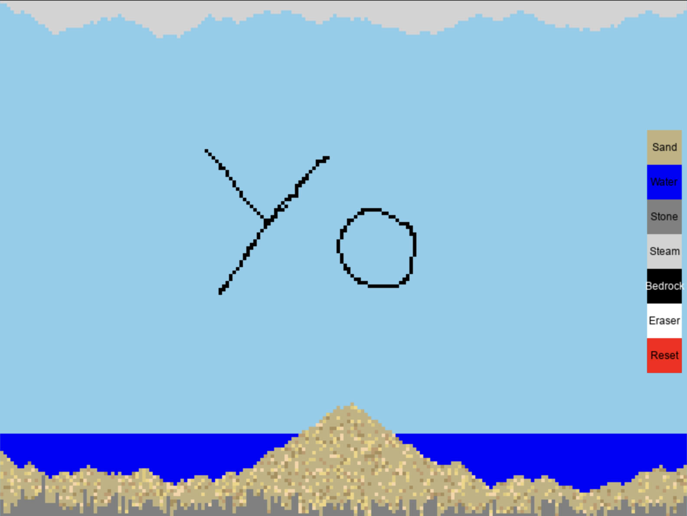

# Falling Sand Simulation

A physics-based particle simulation built with Python and Pygame. Watch as different materials interact and move according to realistic physics rules in a grid-based environment.



## Features

- **Multiple Material Types**: Simulate the behavior of different substances
  - **Sand**: Falls downward and slides diagonally, with varied colors for visual variety
  - **Water**: Flows down and spreads horizontally, seeking the lowest point
  - **Stone**: Heavy and stable, resists gravity and doesn't move
  - **Steam**: Floats upward, rises through the grid
  - **Bedrock**: Immovable foundation material
  
- **Interactive Drawing**: Use mouse to place materials directly on the grid
- **Material Selection**: Easy-to-use button interface to switch between materials
- **Eraser Tool**: Remove materials from the grid
- **Reset Button**: Clear the entire grid to start over
- **Real-time Simulation**: Watch physics rules apply in real-time as materials interact

## How to Use

1. **Start the Simulation**:
   ```bash
   python display.py
   ```

2. **Place Materials**:
   - Click the buttons on the right side to select a material (Sand, Water, Stone, Steam, or Bedrock)
   - Click and drag on the grid to paint with the selected material
   - Use the Eraser button to remove materials
   - Use the Reset button to clear the entire simulation

3. **Observe Physics**:
   - Watch how each material behaves according to its physics rules
   - Sand falls and slides
   - Water flows and spreads
   - Stone stays put
   - Steam rises

## Project Structure

```
├── display.py              # Main display and event handling
├── grid.py                 # Grid data structure and cell management
├── models/
│   ├── cell.py            # Abstract base class for all cell types
│   ├── sand_cell.py       # Sand particle behavior
│   ├── water_cell.py      # Water particle behavior
│   ├── stone_cell.py      # Stone particle behavior
│   ├── steam_cell.py      # Steam particle behavior
│   ├── bedrock_cell.py    # Bedrock particle behavior
│   └── button.py          # UI button component
└── README.md
```

## Requirements

- Python 3.x
- Pygame

## Installation

```bash
pip install pygame
```

## Technical Details

- **Grid Resolution**: 200x150 cells
- **Cell Size**: 4x4 pixels per cell
- **Screen Size**: 800x600 pixels
- **Architecture**: Object-oriented design with an abstract Cell base class
- **Physics Engine**: Real-time cellular automaton simulation

Each material type implements its own physics rules through the `check_rules()` method, allowing for complex interactions while keeping the code organized and extensible.